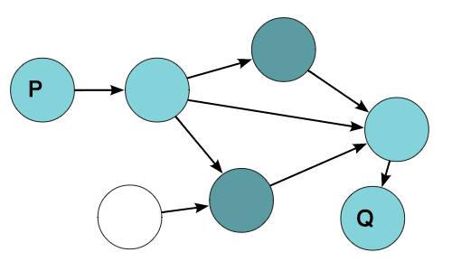
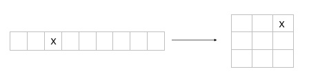

Meet in the middle is a search technique used when the input size is small but not small enough to use direct brute force.
A famous example

####Knapsack
Given a set of **N** (N≤40) integers each of them is at most 10^12 determine the largest sum subset having sum less than or equal **S** (S≤10^18)

If N was 20 we could've tried all possible subsets, but now N is 40 and 2^40 seems too much.

Lets split the numbers into two sets *(A, B)*, first having the first N/2 numbers, second having the rest, now each of the two sets have at most 20 numbers.
Lets calculate subset sums for A and store them in an array *X*, and calculate subset sums for B and store them in an array *Y*.

Now we sort the array Y, and iterate over the elements of X, for each element x in X, we can use binary search to find the largest element y in Y such that x+y≤S.

The answer is maximum x+y and the total running time is $$O(2^{N/2} N)$$

This example is good however it doesn't give much insight about meet in the middle.

---

Here's a more intuitive example
We have an unweighted directed graph with *N* nodes, we want to know if there's a path between two nodes *P*, *Q* with length ≤ *K*, K is even.

We walk K/2 edges forward from P and mark all nodes we visited, and walk K/2 edges backward from Q and mark all nodes we visited, There is a path of length < K iff there's a node marked when moving forward from P and when moving backwards from Q, it's as if having someone at P walk half the distance and someone at Q walk half the distance so that they meet in the middle.

We can apply this to any graph problem as long as we know the start and destination, here's an example problem

Given a 15 puzzle determine if we can solve using at most 20 moves, if so find the shortest sequence of moves.

Number of reachable states is less than or equal 4^20 which is too much, however we already know the source (initial state), and destination (solved state) the board is solvable if we can reach the some state using at most 10 moves from initial and at most 10 moves (reverse) from end final state, finding the shortest sequence of moves isn't much harder.

---

####DNA Analysis-2007[Summer-2007 Petrozavodsk Camp]
Given two strings determine if we can transfer the first to the second using at most four operations, an operation is defined as choosing a contagious subsequence and reversing it.

Direct brute force is $$O(n^8)$$ which is too much for n≤30, however if we work on both strings and meet in the middle we can obtain $$O(n^4)$$, this is not really different from the graph problem we can view strings as nodes in the graph anyways.

As one final example we take a look at a famous algorithm that uses meet in the middle

---
####Log mod
Given a, b and a prime p find smallest x satisfying $$a^x \equiv b\pmod p$$
One thing to do is to try all possible x from 0 to p-1, and choose the first x that satisfies the equation, that's O(p) time and O(1) memory but can we do better ?
Yes, let's first define q, where $$q = \lceil \sqrt{p} \rceil
$$ we can then write any x (0≤x≤p-1) as 
x = rq + c where 0≤r<q, 0≤c≤q, assume we already know r and wanted to find c we have
$$a^{rq} a^c \equiv b \pmod p$$, multiply both sides modular multiplicative inverse
$$a^c \equiv a^{-rq}b \pmod p$$, now we have exactly the same problem however we already know that c≤q so we can answer the query in $$O(\sqrt{p})$$.

To answer that query faster we store all possible (a^c, c) pairs in a binary search tree or a sorted array we can achieve $$O(\log_{2}p)$$.

Now to solve the problem we iterate over all possible r's r≤q, and query the bst/sorted array.

Now that's $$O(\sqrt{p} \log_{2}p)$$ time and $$O(\sqrt{p})$$ memory.

Take a look here Baby-step giant-step for a more general definition of the problem and pseudo code for the algorithm.

We originally viewed the search space as a line, and then we viewed it as a grid and noticed that if know which row the solution is, we can find the column quickly, it's also good to note that we sacrificed some memory in exchange for time.

####Additional problems
* [General Bytor](http://codeforces.com/gym/100096/attachments)
* [EllysBulls](http://community.topcoder.com/stat?c=problem_statement&pm=12420&rd=15492)
* [Cup Of Cowards](https://icpcarchive.ecs.baylor.edu/index.php?option=com_onlinejudge&Itemid=8&category=592&page=show_problem&problem=4769) [[Solution, Harder version]](https://www.quora.com/This-algorithmic-problem-wasnt-solved-on-a-recent-ACM-ICPC-regional-contest-How-can-it-be-solved/answer/Islam-Al-Aarag)