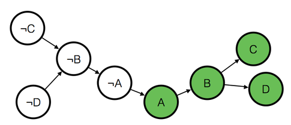

[Boolean satisfiability problem (SAT)](https://en.wikipedia.org/wiki/Boolean_satisfiability_problem) is a problem where we are given a boolean expression, asking whether there exists an assignment of variables that makes the expression true.

It's known that SAT is NP-Complete meaning that nobody was able to solve this problem quickly (in polynomial time) and the best we can do is exponential algorithms, However there are some special cases of SAT which we can solve in polynomial time and this is the topic of the post.

#### 2-SAT
In 2-SAT we're given a boolean expression in the form of conjunction (and) of a set of clauses, where each clause is a disjunction (or) of two variables, we want to find if there's an assignment of these variables that makes the expression true.
Example

Here we have three clauses anded together, A or B, C or not B and D or not A, we want to find values for boolean variables A, B, C and D that make this expression true one option is A true, B false, C false and D true.

$$ (A \lor B) \wedge (C \lor \lnot B) \wedge (D \lor \lnot A)$$

Now how do we solve 2-SAT ? 

First we construct a graph called Implication graph using the given clauses and variables, each variable has two nodes in the implication graph one for the variable and one for it's complement.

The edges are constructed from implications, If we know that $$(A \lor B)$$ must be true then we know that if A is false B must be true, if B is false then A must be true, this can be written as $$(\lnot A \implies B) \wedge (\lnot B \implies A)$$ thus we connect an edge from ¬A to B and an edge from ¬B to A, we do this for every clause we have.

By construction the graph has a special property if we take any edge and reverse it's direction, complement it's nodes the resulting edge will also exist in the graph.

An assignment exists if and only if there's no cycle in this graph that contains a variable and it's complement, why ?

First notice that implication is transitive meaning that if $$A \implies B$$ and $$B \implies C$$ then $$A \implies C$$ thus if there's a path between pair of nodes X and Y then $$X \implies Y$$.

Now what does it mean to have A and ¬A in a cycle ? It means $$(A \implies \lnot A) \wedge (\lnot A \implies A)$$ must be true, which is a contradiction.

If there's no such a cycle, we can always find a satisfying assignment easily, first lets compress strongly connected components into a single node, we are left with a directed acyclic graph then, a satisfying assignment can be seen as a coloring for that graph where if node A is colored then A must be true, if node ¬A is colored, then A must be false. In such a coloring exactly one of {A, ¬A} must be colored, and if there's a path between two nodes X and Y and X is colored, then Y also must be colored (by implication), If we can find such a coloring then we're done.

We can find such a coloring easily, by doing a topological sort on the graph and start coloring nodes in reverse topological order, if the complement of a node is colored, then we don't color it.

In a general graph this might not always work, however due to the special property in our graph this will work since if we ever meet a node X that we couldn't color, then we've colored ¬X, also we colored all nodes ¬Y such that $$Y \implies X$$, since we know by the special property that $$\lnot X \implies \lnot Y$$.

---

#### [ColorfulDecoration](http://community.topcoder.com/stat?c=problem_statement&pm=10739&rd=14149) [TopCoder SRM 464 DIV1 Level 2]

Let's assume we know that minimum size let that be K can we tell if we can put the squares in appropriate places so that they do not intersect ?

It's not good to set the size of any square larger than the K since larger size causes more conflicts.

Lets create a boolean C variable for each square i, where C_i is false if square i is centered at (xa[i],ya[i]) and true if  it's centered at (xb[i],yb[i]).

Now if  squares centered at (xa[i],ya[i]) and  (xa[j],ya[j]) intersect we should add a constraint that C_i and C_j can't be both false, this is written as $$(C_i \lor C_j)$$ same goes for all other pairs of centers, doing this for all conflicts will give us an expression having clauses containing exactly two variables which can be solved using 2-SAT, If there exists an assignment that makes such an expression true, then the minimum size could be K, otherwise then the minimum size must be less than K.

Now how do we find K ? if K works then K-1 also works, this means we could use binary search to find K.

--- 

#### XOR-SAT
Given a boolean expression on the form of a conjunction(and) of a set of clauses where each close is an exclusive disjunction(xor) of variables, we want to find if there's an assignment of these variables that makes the expression true
Example

$$(A \oplus B \oplus C) \wedge (A \oplus E)$$

Meaning that we must have an odd number of trues in {A, B, C} and {A, E}.

#### XOR-2-SAT
Before solving the general XOR-Sat let's first try to solve XOR-2SAT where each clause contains just two variables and there's no complement variables.

We construct a graph where the nodes are the variables, and the edges are the clauses where there's an edge between node i and j if there's a clause $$(i \oplus j)$$.

If this graph is bipartite then our formula is satisfiable, since we could color the nodes in two colors  (true, false) where edges lie between nodes of different colors (each clause contains one true and one false).

We can also count the number of assignments, we know for each connected component we can either set the left nodes to true, right nodes to false or vice versa, thus the number of assignments is $$ 2^{cc}$$  where cc is the number of connected components.

Now back to the **general XOR sat** problem, we want each clause to have an odd number of trues.

If we rewrite each clause as a modular linear equation where variables take 1 or 0 (instead of true or false), we can then see that finding a satisfying assignment is equivalent to solving a system of linear equations.

For example a clause 

$$ (X_0 \oplus X_1 \oplus ... \oplus X_k) \equiv true$$ 

Can be written as

$$ X_0 + X_1 + ... + X_k \equiv 1 \pmod 2$$ 

Such a system is easily solvable using [Gaussian elimination](https://en.wikipedia.org/wiki/Gaussian_elimination), however all operations must be done modulo 2.

---

Having little more knowledge of linear algebra and understanding the meaning of linear independence, can allow us to do much more.

General systems of linear equations and linear independence
Assume we have a general system of linear equations i.e a bunch of equations on the form

$$  a_{11}x_1 + ... + a_{1n}x_n = b_1$$ 

$$  a_{21}x_1 + ... + a_{2n}x_n = b_2$$ 

...

$$  a_{n1}x_1 + ... + a_{nn}x_n = b_n$$ 

Such a system can be solved using Gaussian elimination, but we're not interested in how to solve it here, we're more interested about the solution itself. If we interpret each of the given equations into an equation of a plane (no matter what a plane looks like in n dimensions), then the solution is the intersection of all those planes.

Another way to look at it is to see all these equations as a single equation of vectors:

$$ x_1 [a_{11} ... a_{n1}]^\top + ... + x_n [a_{1n} ... a_{nn}]^\top = [b_1  ... b_n]^\top$$ 

Here each $$ x_i$$  is a scale for some vector from the available column vectors, we are required to select a scale for each vector such that their addition becomes some point in the space $$ (b_1, b_2, ..., b_n)$$ .

We can also view each of the available column vectors as a degree of freedom, or a direction we can move in.

For example if we were in 3D space, and we had two vectors $$ v_1 = [0, 0, 1]^\top$$ ,  $$ v_2 = [0, 1, 0]^\top$$ , if we multiply those vectors by any factors and add them up we would still be moving in a 2D plane.

If we add a new vector $$ v_3 = [1, 0, 0]^\top$$ , we would be able to span the whole space.

Adding a new vector $$ v_4 = [-1, 0, 1]^\top$$  however is useless, since we can obtain this vector using $$ v_3$$  and $$ v_2$$ , thus such a vector doesn't add any new point to the set of reachable points, such a vector is called a linearly dependent vector, or a vector that can be found as a linear combination from the remaining set of vectors.

The number of linearly independent row or column vectors in a matrix is called the rank of a matrix.

---

#### Counting solutions to XOR-SAT
Instead of asking for a single solution, one might want to count the number of solutions for a given boolean expression with n variables, we construct a matrix M where each clause is a row, and each column is a variable. The number of solutions then is equal to $$ 2^{n - rank(M)}$$ .

Why? Because a linearly dependent column vector means a redundant variable or a variable which we can set to any value and then use linearly independent vectors (non redundant variables) to undo any effect of what we did.

---

#### [XOR Maximization](http://www.spoj.com/problems/XMAX/) [SPOJ XMAX]
A Nice property of linear independence, is that if you are given K linearly independent vectors, whatever linear operations you do on those (add ones multiplied by a factor to the others) they would still stay linearly independent, moreover the space or set of points reachable using those vectors doesn't change, we use such a fact to make the solution of the problem more easy or more trivial.

We see the given numbers as column vectors and the bits are the rows, we first take the number with the highest bit, and eliminate that highest bit from all other numbers, then do the same for the second highest bit using another number,... and so on.
 
If we do this operation for all bits, the answer becomes trivial, we greedily take all the numbers, because then each number is 

* A Zero:  this means that all the bits in this number where eliminated by other numbers, thus we can take it or leave it it doesn't matter.
* A Single bit: this means we used this number to eliminate this bit from all other numbers thus taking this number means setting that bit in the result.
* Multiple bits: this means that we used this number to eliminate the **highest one bit in it** from other numbers, taking this number means setting that highest bit in the result and possibly clearing some of the lower bits, but one Kth bit is better than all all smaller bits together, so we must take this number as well.

---

#### Readings
* [2-SAT (2-CNF)](http://e-maxx.ru/algo/2_sat)[Russian use google translate]
* [Solving systems of linear equations](http://e-maxx.ru/algo/linear_systems_gauss)[Russian use google translate]
* [Computing matrix rank](http://e-maxx.ru/algo/matrix_rank)[Russian use google translate]

#### Additional Problems
* [Manhattan](https://uva.onlinejudge.org/external/103/p10319.pdf)
* [Chip Installation](http://codeforces.com/gym/100430)
* [TV Show](http://codeforces.com/gym/100342/)
* [Square](https://uva.onlinejudge.org/external/115/p11542.pdf)
* [LightSwitches](http://community.topcoder.com/stat?c=problem_statement&pm=6407)

